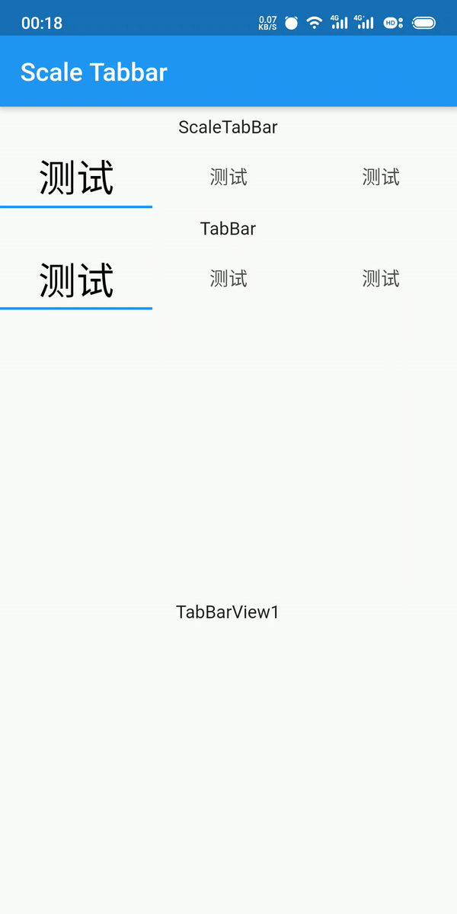

# [Flutter] 解决TabBar文字抖动问题 , 自定义水波纹样式 , 添加更多事件

## 效果对比

-|-|-
-|-|-
||
Emmm...  gif效果不太理想,但能看出区别

## 实现过程

### `拷贝` 官方源码进行分析 , 顺藤摸瓜 , 删除一些代码排除干扰 , 在 `tabs.dart` 中找到了TabBar的实现方法

### ~~TabBarIndicatorSize~~

### ~~Tab~~

### ~~TabBarView~~

### ~~_TabBarViewState~~

### ~~TabPageSelectorIndicator~~

### ~~TabPageSelector~~

```dart
///TabBar
class TabBar extends StatefulWidget implements PreferredSizeWidget {
    ...
}
```

> ### 1.修复文字抖动

文字的样式变换是绑定在TabController上的,官方的策略是每次位置变动重新渲染文字样式,但是Flutter的文本样式变化并不是平滑过渡的

```dart
class _TabStyle extends AnimatedWidget {
  ...
  @override
  Widget build(BuildContext context) {
      ...

      ///计算文本样式插值
      final TextStyle textStyle = selected
      ? TextStyle.lerp(defaultStyle, defaultUnselectedStyle, animation.value)
      : TextStyle.lerp(defaultUnselectedStyle, defaultStyle, animation.value);

      return DefaultTextStyle(
      ///构建文本样式(问题就出在这里)
      style: textStyle.copyWith(color: color),
      child: IconTheme.merge(
        data: IconThemeData(
          size: 24.0,
          color: color,
        ),
        child: child,
      ),
    );
  }
}
```

***解决思路***

* 禁用文本大小变化
* 用scale实现Tab的缩放效果

```dart
///根据前后字体大小计算缩放插值(这里还有一些逻辑关系要梳理 , 被绕晕了)
final double magnification = 2 - unselectedLabelStyle.fontSize / labelStyle.fontSize;
final double scale = selected
    ? lerpDouble(magnification, 1, animation.value)
    : lerpDouble(1, magnification, animation.value);

return DefaultTextStyle(
    style: textStyle.copyWith(
        ///文字大小钉死为没有选中的状态
        color: color, fontSize: unselectedLabelStyle.fontSize),
    child: IconTheme.merge(
    data: IconThemeData(
        size: 24.0,
        color: color,
    ),

    ///添加一个缩放外壳
    child: Transform.scale(
        scale: scale,
        child: child,
    ),
    ),
);
```

这样我们就得到了一个切换相对平滑的TabBar

> ### 2.自定义点击水波纹

TabBar的点击是用 `InkWell` 实现的

```dart
///_TabBarState
class _TabBarState extends State<ScaleTabBar> {
    ...
    @override
    Widget build(BuildContext context) {
        ...
        for (int index = 0; index < tabCount; index += 1) {
            ///生成tabs的时候嵌套了一层InkWell
            wrappedTabs[index] = InkWell(
                ...
            );
        }
    }
}
```

***实现思路***

* 给TabBar添加水波纹相关的属性
* 引用属性

```dart
///TabBar
class TabBar extends StatefulWidget implements PreferredSizeWidget {
    ...
    const TabBar({
        ...
        this.splashColor = Colors.transparent,
        this.highlightColor = Colors.transparent,
        this.borderRadius = const BorderRadius.all(Radius.circular(0)),
        ...
    })
  ...
  ///波纹颜色 , 默认为 [Colors.transparent]
  final Color splashColor;

  ///高亮颜色 , 默认为 [Colors.transparent]
  final Color highlightColor;

  ///波纹的圆角大小 , 默认为 0
  final BorderRadius borderRadius;
}
```

```dart
///_TabBarState
class _TabBarState extends State<TabBar> {
    ...Colors
    @override
    Widget build(BuildContext context) {
        ...
        for (int index = 0; index < tabCount; index += 1) {
            wrappedTabs[index] = InkWell(
                ...
                ///波纹样式相关属性
                splashColor: widget.splashColor,
                highlightColor: widget.highlightColor,
                borderRadius: widget.borderRadius,
            );
        }
    }
}
```

因为设置了默认颜色为 `Colors.transparent` , 所以默认情况下点击tab不会出现水波纹 , 需要的时候可自定义 , 更多效果可自行添加

> ### 3.添加更多点击事件

此处以双击为例  
先来看看自带的onTap是怎么实现的

```dart
///TabBar
class TabBar extends StatefulWidget implements PreferredSizeWidget {
    const TabBar({
        ...
        this.onTap,
    })
  ...
  ///点击回调
  final ValueChanged<int> onTap;
}
```

```dart
///_TabBarState
class _TabBarState extends State<TabBar> {
    ...
    ///onTap的具体实现
    void _handleTap(int index) {
        assert(index >= 0 && index < widget.tabs.length);
        ///跳转tab
        _controller.animateTo(index);
        if (widget.onTap != null) {
            ///不为空则触发
            widget.onTap(index);
        }
    }
  
    @override
    Widget build(BuildContext context) {
        ...
        for (int index = 0; index < tabCount; index += 1) {
            ///生成tabs的时候嵌套了一层InkWell
            wrappedTabs[index] = InkWell(
                ...
                ///点击事件
                onTap: () {
                    _handleTap(index);
                },
            );
        }
    }
}
```

很简单 , 依葫芦画瓢就行了

```dart
///TabBar
class TabBar extends StatefulWidget implements PreferredSizeWidget {
    const TabBar({
        ...
        this.onTap,
    })
  ...
  ///点击回调
  final ValueChanged<int> onTap;
}
```

```dart
///_TabBarState
class _TabBarState extends State<TabBar> {
    ...
    ///onDoubleTap的具体实现
    void _handleDoubleTap(int index) {
        assert(index >= 0 && index < widget.tabs.length);
        if (widget.onDoubleTap != null && _currentIndex == index) {
            ///当为选中tab时才能触发双击事件
            widget.onDoubleTap(index);
        }
    }
  
    @override
    Widget build(BuildContext context) {
        ...
        for (int index = 0; index < tabCount; index += 1) {
            ///生成tabs的时候嵌套了一层InkWell
            wrappedTabs[index] = InkWell(
                ...
                ///添加双击事件
                ///注意:有延时的事件会影响onTap的触发速度 , 不建议使用
                ///触发前判断一下 , 如果为null则不设置回调 , 消除对onTap的影响
                onDoubleTap: widget.onDoubleTap == null ? null : () => _handleDoubleTap(index),
            );
        }
    }
}
```

### 萌新一枚 , 没有常写文章 , 欢迎指出问题或错误

### 修改后的代码封装为了 `ScaleTabBar` 控件 , 已上传Github , 使用方法与官方完全一致 , 希望能帮到你

### [项目地址](https://github.com/xSILENCEx/flutter_scale_tabbar)
